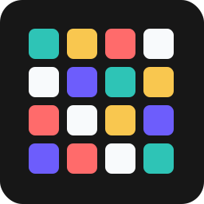

<div align="center">
  
  <h1>VibeGrid</h1>
  <p><strong>Group the words. Guess the vibe.</strong></p>
  <p>A daily semantic grouping puzzle: 16 tiles, 4 hidden vibe-based categories, 4 mistakes, and a spoiler-safe result to share.</p>
</div>

<!-- Add a screenshot or GIF here once deployed, e.g. docs/demo.png -->

VibeGrid is a small product with real game state: a daily puzzle anyone can play
without signing up, an editor desk for authoring puzzles, and a public builder so
players can make and share their own grids. It is built as a Go API plus a
Next.js front end, with server-authoritative game rules and durable,
transaction-safe attempts.

## Highlights

- **Server-authoritative gameplay.** The browser receives tile text and ids but
  never group membership; the Go API validates every guess and only reveals a
  group after a correct submission. The answer key never reaches the client.
- **Transaction-safe, idempotent guesses.** Each guess runs inside a Postgres
  transaction that `SELECT … FOR UPDATE`-locks the attempt row. A unique
  `(attempt_id, client_guess_id)` constraint makes retries and double-clicks
  idempotent, so concurrent submissions can't corrupt mistake counts or
  completion state. (Proven by concurrency tests run under the race detector.)
- **Pluggable storage.** A `Store`/`PuzzleSource` interface backs both a Postgres
  implementation and an in-memory one, so the app runs (and tests) with or
  without a database.
- **Self-migrating.** Embedded SQL migrations (goose) apply on startup.
- **User-generated content.** A public, rate-limited create flow lets anyone
  author a puzzle and share a play-by-link; community puzzles stay out of the
  daily rotation by design.
- **Tested and CI'd.** Go unit + integration tests (including a Postgres service
  container in GitHub Actions) and a typed, lint-clean front end.

## Tech stack

| Layer | Choice |
| --- | --- |
| API | Go (stdlib `net/http`, `log/slog`) |
| Database | Postgres (`pgx`, goose migrations) |
| Web | Next.js App Router, React, TypeScript |
| Styling | Tailwind CSS |
| Identity | Anonymous session cookies |

## Architecture

```
Browser ──▶ Next.js (UI + /api/* rewrite proxy) ──▶ Go API ──▶ Postgres
```

The Go service owns game rules, sessions, attempts, idempotency, and puzzle
authoring. The Next.js app renders the UI and proxies `/api/*` to the API, so
the browser only ever talks same-origin.

## Getting started

```bash
npm install
npm run dev
```

`npm run dev` starts the Go API on `http://localhost:8081` and the Next front end
on `http://localhost:3000`. Without a database it uses an in-memory store and a
seeded puzzle, so it runs out of the box.

Useful commands:

```bash
npm run dev:backend   # Go API only
npm run dev:web       # Next.js only
npm run test          # front-end tests
npm run test:backend  # Go tests
npm run typecheck
npm run build
```

## Database

Set `DATABASE_URL` to use the durable, transaction-safe Postgres path; the
backend migrates itself on boot.

```bash
createdb vibegrid
DATABASE_URL="postgres://USER@localhost:5432/vibegrid?sslmode=disable" npm run dev:backend
```

Integration tests run against a real Postgres when `TEST_DATABASE_URL` is set,
and are skipped otherwise:

```bash
createdb vibegrid_test
TEST_DATABASE_URL="postgres://USER@localhost:5432/vibegrid_test?sslmode=disable" go test -race ./backend/...
```

See [.env.example](.env.example) for all configuration (`VIBEGRID_ADMIN_TOKEN`,
`VIBEGRID_ALLOWED_ORIGINS`, `VIBEGRID_SECURE_COOKIES`, …).

## Routes

- `/` — today's puzzle. `/archive` — past daily puzzles.
- `/create` — public puzzle builder; returns a shareable `/p/<id>` link.
- `/p/<id>` — play any puzzle by link.
- `/admin` — Editor Desk (author drafts, publish one puzzle per date). Requires
  `VIBEGRID_ADMIN_TOKEN` on the backend and a database.

## Project docs

Product vision, the decision register, the engineering roadmap, and the tech
stack rationale live in [`docs/`](docs/).

## License

[MIT](LICENSE)
