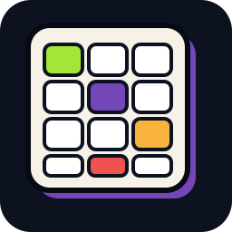

<p align="center">
  
</p>

<h1 align="center">VibeGrid</h1>

<p align="center"><strong>Make the vibe. Let the crew decide.</strong></p>

VibeGrid is a daily asynchronous social game. Everyone receives the same prompt
and twelve human-written fragments. Each person chooses four, gives the
combination a title, and submits one “vibe card” to a private crew. The next day,
people who played judge the cards without seeing the authors. The day after that,
the result reveals who made what.

There is no answer key. The interpretation—and what it says about the people in
the room—is the product.

## The product contract

```text
DAY D · MAKE                 DAY D+1 · JUDGE             DAY D+2 · REVEAL
12 shared fragments   ───▶  authors hidden        ───▶  author + votes shown
pick exactly 4              one non-self vote           ties stay ties
write one title             makers only can vote        ≥3 cards + ≥2 votes = official
```

- The daily board is a creative constraint, not a puzzle with a concealed
  partition.
- A private crew is the primary product. The public homepage is a complete
  practice round that teaches the make → judge → reveal loop without signup.
- Submission and vote authorship are enforced inside database transactions.
- A member sees only their own card during the make phase. Eligible judges see
  cards without authors. Results reveal authors to current crew members.
- One card and one ballot are allowed per member per board. Client-generated
  replay ids make timed-out retries safe.
- A result is “official” only with at least three cards and two ballots. Small
  or quiet rounds still reveal honestly but do not extend the crew streak.
- VibeGrid uses one global UTC rollover. Open tabs are never forcibly replaced;
  the next fetch reconciles the current stage.

The full rationale and non-goals live in
[`docs/product-vision.md`](docs/product-vision.md). Ratified behavior lives in
[`docs/decision-register.md`](docs/decision-register.md).

## Why this is not an NYT Connections clone

The old implementation was one: sixteen words, four hidden groups, four
mistakes, solve time, colored result squares, and a social layer attached after
the solitary game. That loop remains only behind legacy `/p/<id>` links so old
shared URLs do not break.

The active VibeGrid loop changes the player’s job and the source of truth:

| | Hidden-group word puzzle | VibeGrid |
| --- | --- | --- |
| Player action | Recover an editor’s intended answer | Author an interpretation |
| Truth | One concealed partition | No canonical answer |
| Social role | Compare independent scores afterward | Other people’s cards and votes are the game |
| Primary object | Solved grid | Named four-fragment card |
| Suspense | “Did I find it?” | “Who made this, and will it land?” |
| Return loop | Next puzzle | Make today, judge yesterday, reveal the day before |

Changing colors, typography, difficulty labels, or share copy could never have
created this distinction. The mechanic had to change.

## What is implemented

### Product and UI

- A complete browser-only public practice round.
- Private crew creation, join links, rotatable invites, owner removal, leaving,
  and ownership transfer.
- Staged make, blind judge, and reveal surfaces with a 30-second visible-tab
  refresh.
- A launch visual system that fuses the strongest Toy, Arcade, and Sticker
  directions: deep-ink ground, cream physical cards, hard offset shadows,
  Bricolage Grotesque, IBM Plex Mono, and a restrained lime/amber/coral/violet
  palette.
- A raster 1200×630 social card plus a new 12-fragment brand mark.
- An authenticated board room for freezing one prompt and twelve unique
  fragments for a future date.

### Correctness and security

- Go owns membership checks, one-card/one-vote invariants, no-self-vote rules,
  replay semantics, result thresholds, ties, and staged disclosure.
- Postgres stores immutable dated board snapshots, card author snapshots, and
  ballots with uniqueness constraints and cascade/restrict behavior.
- Public identifiers and JSON bodies are capped and validated before storage
  work. Public reads and anonymous writes are rate-limited.
- Production guardrails require Postgres, secure cookies, an exact HTTPS public
  base URL, protected metrics, and explicit trusted proxy CIDRs.
- Admin browser sessions are opaque, revocable, HttpOnly, hash-only in storage,
  and CSRF-protected for cookie-authenticated mutations.
- Canonical/robots/sitemap metadata comes from `VIBEGRID_PUBLIC_BASE_URL`, not
  attacker-controlled request hosts. Crew and compatibility links are omitted
  from the sitemap.

### Runtime and operations

- A multi-stage Docker build exports Next.js, embeds the static site and SQL
  migrations in the Go binary, and runs as a non-root distroless container.
- Embedded additive migrations, health/readiness probes, structured logs,
  bounded route metrics, DB/cache/outbox metrics, graceful shutdown, and
  retention cleanup.
- Fly and Render deployment scaffolding, CI, protected metrics, smoke tests, and
  restore/incident/secret-rotation runbooks.

Provider-owned settings—managed backups, a completed restore drill, branch
protection, external uptime/error alerting, and a verified permanent public
domain—remain manual work and are not claimed as complete.

## Architecture

```text
Browser
  ├─ public practice (local state only)
  └─ private crew UI
          │ same-origin JSON + HttpOnly guest cookie
          ▼
Go HTTP binary
  ├─ board/stage projection and authorization
  ├─ crew, submission, and vote transactions
  ├─ admin auth and immutable board authoring
  ├─ rate limits, metrics, health, SEO, legacy compatibility
  └─ embedded exported Next.js frontend + embedded migrations
          │
          ▼
Postgres
  ├─ vibe_daily_boards
  ├─ vibe_submissions
  ├─ vibe_votes
  ├─ crews / crew_members
  └─ admin, idempotency, moderation, legacy attempt tables
```

Important implementation entry points:

- `backend/internal/vibegrid/vibe_boards.go` — deterministic fallback board bank
  and strict 12-fragment validation.
- `backend/internal/vibegrid/vibe_rounds.go` — transactional store and replay
  rules.
- `backend/internal/vibegrid/vibe_round_handlers.go` — stage projection and
  privacy boundary.
- `backend/internal/vibegrid/vibe_board_admin.go` — immutable dated authoring.
- `backend/db/migrations/00018_vibe_rounds.sql` — durable schema and constraints.
- `src/components/VibeGridApp.tsx` — public practice loop.
- `src/components/CrewRoom.tsx` — make, judge, result, membership, and invite UX.
- `src/components/VibeComposer.tsx` and `VibeCard.tsx` — core interaction atoms.
- `src/components/VibeBoardDesk.tsx` — editor board room.
- `scripts/smoke.mjs` — runtime contract, including replay-safe crew submission
  when a database is attached.

## Run locally

```bash
npm install
npm run dev
```

Open `http://localhost:3000`. Without `DATABASE_URL`, the public practice round
works and crew endpoints explicitly return `503`; the app never pretends an
in-memory crew is durable.

For the full path:

```bash
createdb vibegrid
DATABASE_URL="postgres://USER@localhost:5432/vibegrid?sslmode=disable" npm run migrate:backend
DATABASE_URL="postgres://USER@localhost:5432/vibegrid?sslmode=disable" npm run dev:backend
npm run dev:web
```

See [`.env.example`](.env.example) for runtime configuration.

## Routes

- `/` — today’s complete practice round.
- `/crews` — create a crew or return to existing crews.
- `/crew/<invite>` — join or play the crew’s make/judge/reveal stack.
- `/admin` — authenticated immutable daily-board authoring.
- `/privacy`, `/terms`, `/policy` — crew-specific launch policies.
- `/archive`, `/create`, `/demo` — pivot explanation/practice compatibility.
- `/p/<id>` — explicitly legacy hidden-group links; retained so old URLs resolve.
- `/healthz`, `/readyz`, `/metrics`, `/robots.txt`, `/sitemap.xml` — runtime and
  operational surfaces. Metrics require a bearer token when enabled.

Primary APIs:

- `GET /api/vibes/today`
- `GET /api/crews/<invite>/daily`
- `POST /api/crews/<invite>/submissions`
- `POST /api/crews/<invite>/votes`
- `GET|POST /api/admin/vibe-boards`

## Verification

```bash
npm run typecheck
npm run lint
npm test
npm run test:security
npm run test:backend
go vet ./backend/...
go test -race ./backend/...
npm run build
git diff --check
```

Set `TEST_DATABASE_URL` to exercise the real transactional crew integration
tests. `npm run test:e2e` builds the exported frontend and Go binary, starts the
single-container path, and runs the smoke contract; local port binding may need
an unrestricted environment.

## Deliberate boundaries

- No accounts, OAuth, email, chat, presence, matchmaking, push notifications,
  monetization, or public leaderboard.
- No public feed of cards. Crew history is private to current members.
- No real-time protocol. Visible crew pages poll; measured demand must justify
  SSE/WebSocket complexity.
- No AI-generated publishing. Editorial constraints are small enough that taste
  and safety should remain visibly human.
- No mutation of a frozen daily board.
- No claim of production traffic, retention, backup recovery, or alert delivery
  until external evidence exists.

## Portfolio framing

**Short title:** VibeGrid — asynchronous social authorship game.

**One sentence:** Built a Go/Postgres/Next.js daily crew game where players make
four-fragment cards, judge them blind the next day, and reveal authors and votes
afterward, with transaction-safe replay, capability-link membership, immutable
editorial boards, staged privacy, CI, observability, and a single-binary deploy.

See [`docs/RECRUITER_EVIDENCE.md`](docs/RECRUITER_EVIDENCE.md) for claim-to-code
proof and [`docs/resume-points.md`](docs/resume-points.md) for honest wording.

## Documents

- [Product vision](docs/product-vision.md)
- [Decision register](docs/decision-register.md)
- [Recruiter evidence](docs/RECRUITER_EVIDENCE.md)
- [Production readiness](docs/production-readiness.md)
- [Launch and proof plan](docs/launch-sprint-plan.md)
- [Daily board operations](docs/daily-puzzle-operations.md)
- [Deployment runbook](docs/deployment.md)
- [Observability runbook](docs/observability.md)
- [Punchline reimagination prompt](docs/PUNCHLINE_REIMAGINATION_PROMPT.md)

## License

[MIT](LICENSE)
