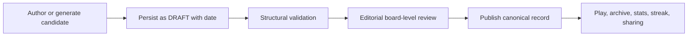
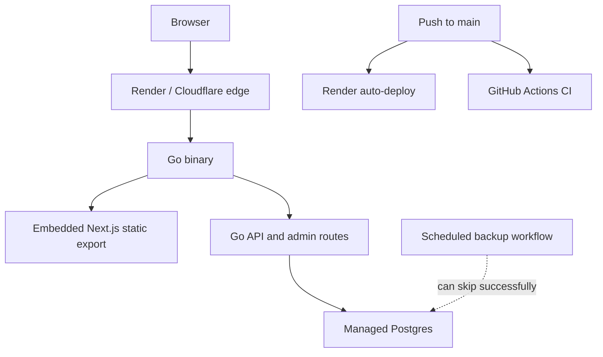
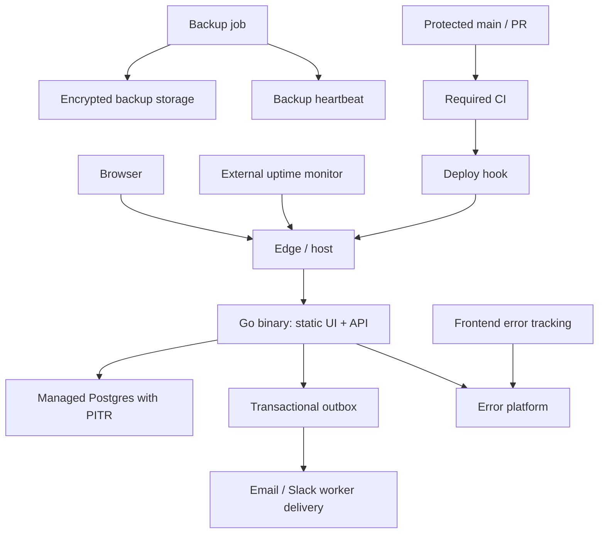
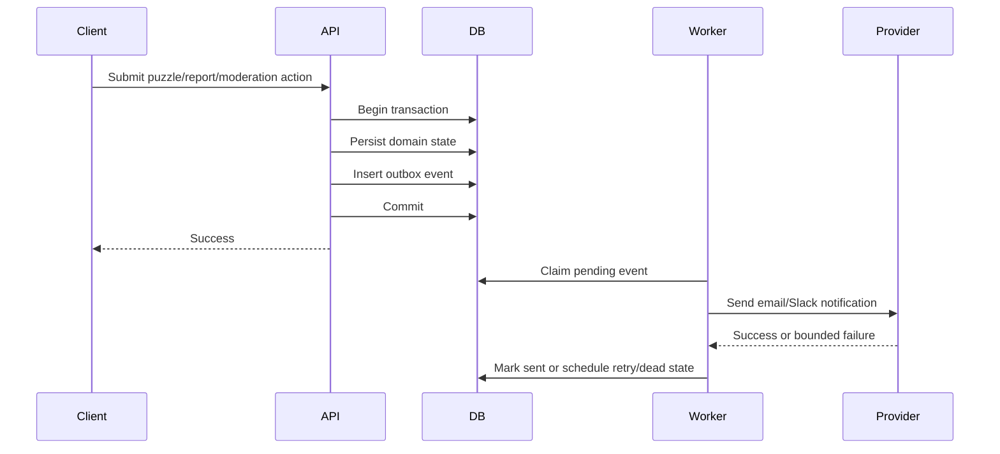

# VibeGrid Launch Readiness Review

**Review date:** August 1, 2026

**Audience:** Product owner, engineering owner, launch reviewer, and future maintainers

**Decision:** Not ready for a broad consumer launch. Suitable as a recruiter demo; suitable for a controlled beta after the P0 exit criteria in this document are met.

This document is the current source of truth for VibeGrid's product, software,
security, runtime, and operational readiness. It deliberately distinguishes
between behavior proven in code, behavior exercised in tests or on the live
deployment, and provider settings that still require manual verification.

The central conclusion is simple:

> Go and Next.js are sound choices, and the codebase contains stronger security
> and backend engineering than a typical portfolio project. The launch risks are
> concentrated in the daily-puzzle data model, false confidence around backups,
> deployment governance, production observability, and unresolved product focus.

---

## 1. Executive decision

| Launch posture | Decision | Conditions |
| --- | --- | --- |
| Local development | **Ready** | Core flows and automated checks work locally. |
| Recruiter demonstration | **Ready with disclosed gaps** | Describe the deployment as a demo or beta; do not claim verified backups, production uptime, or broad consumer readiness. |
| Controlled public beta | **Blocked** | Complete the five P0 workstreams and their acceptance checks. |
| Broad consumer launch | **Blocked** | Complete P0 and P1, then demonstrate a clean production soak including rollover, backup, restore, deploy, and database-restart behavior. |

### Original P0 launch blockers and current disposition

1. **Code fixed:** the backup workflow now fails when required secrets are absent;
   managed backup/PITR and a restore drill remain manual.
2. **Code fixed:** canonical bank dailies are proactively persisted and sequence
   numbering avoids date/number collisions; production rollover soak remains.
3. **Partly fixed:** Render auto-deploy is disabled and the deploy workflow waits
   for CI; GitHub branch protection remains a manual provider setting.
4. **Code fixed:** the identified JavaScript and Go vulnerability findings were
   upgraded; registry-backed audit gates still need CI/network verification.
5. **Manual:** external uptime, error, and backup-freshness alert delivery is not
   yet verified.

These are not theoretical scale concerns. They affect data recovery, the core
daily product promise, release safety, and the operator's ability to detect a
failed system.

### Current implementation tracker

- [x] Phase 0 code changes: backup truth, deploy gating defaults, JS/Go upgrades.
- [x] Phase 1: canonical daily persistence and coherent numbering.
- [x] Phase 2: atomic moderation, generation-safe cache writes, hybrid rate
  limiting/pruning, non-guess idempotency, and canonical wrong-guess sets.
- [x] Phase 3 shipping set: consumer navigation, adjacent mobile submit, browser
  UUID idempotency keys, immutable attempt mode, Turnstile, hash-only creator
  claims/status/withdrawal, and a transactional notification outbox.
- [ ] Phase 3 remaining: privacy-conscious product analytics plus browser E2E and
  automated accessibility coverage.
- [ ] Provider/operations work: production Turnstile keys, notification webhook,
  managed backups/PITR, restore drill, branch protection, external alerts, and soak.

---

## 2. Product and engineering thesis

**Product:** A daily semantic grouping puzzle with a public play loop, spoiler-safe
sharing, community puzzle submissions, and an operator moderation/editor desk.

**Primary user:** A casual daily puzzle player. Secondary users are community
creators and the single operator/editor.

**Core loop:** Open today's grid, submit server-authoritative guesses, finish or
fail the board, see a spoiler-safe result, share it, and return for the next daily.

**Strongest engineering case:** VibeGrid can demonstrate that a small consumer
game still deserves correct transactional state, secure guest/admin boundaries,
durable content and attempts, moderation, observable runtime behavior, and a
simple deployable architecture.

The repository should prove these five capabilities:

1. Server-authoritative, retry-safe game state.
2. A coherent and durable daily-puzzle lifecycle.
3. Secure anonymous participation and accountable moderation.
4. A single-binary web deployment with bounded runtime behavior.
5. Honest operational readiness: guarded releases, observable failures, and
   recoverable data.

The current repository strongly supports capability 1, partially supports 3 and
4, and does not yet fully prove 2 or 5.

---

## 3. Review scope and evidence

The review covered:

- frontend routes, state, responsive interaction, API clients, and response
  validation;
- Go HTTP routing, game rules, sessions, admin authentication, moderation,
  caching, rate limiting, stats, and runtime lifecycle;
- Postgres migrations, constraints, transaction boundaries, retention, and
  integration-test behavior;
- CI, dependency scanning, backup workflows, Docker packaging, and Render
  deployment configuration;
- the public Render deployment, health/readiness behavior, archive API, static
  caching behavior, and cold-start behavior;
- product positioning, daily content quality, creator/moderator workflows,
  growth loops, analytics, and external-service requirements.

### Verification observed during this review

The following commands passed during the audit:

```bash
npm run typecheck
npm run lint
npm test
npm run test:security
go test ./backend/...
go vet ./backend/...
go test -race ./backend/...
npm run build
npm run test:e2e
git diff --check
```

Important limitations:

- Local Postgres integration tests skip when `TEST_DATABASE_URL` is unset; a
  plain passing Go test run therefore does not prove the durable path. See
  [`postgres_store_test.go`](../backend/internal/vibegrid/postgres_store_test.go#L38).
- `npm run test:e2e` builds the application and exercises HTTP smoke flows in
  development/in-memory mode. It does not start Postgres and is not a real
  browser test. See [`scripts/e2e.mjs`](../scripts/e2e.mjs#L15).
- The last inspected CI run for the deployed `main` commit was green and did use
  Postgres. That does not compensate for the branch and deployment gate being
  optional.
- The public deployment was healthy when inspected. That is an observation, not
  an uptime guarantee.
- The JavaScript packages implicated by the original high-severity audit were
  upgraded; rerun the registry-backed audit in CI or another networked environment.
- The reachable `golang.org/x/text` finding from the original review was resolved
  by upgrading the Go dependency.

---

## 4. Readiness scorecard

| Area | Status | Strongest evidence | Material weakness |
| --- | --- | --- | --- |
| Core game rules | **PROVEN** | Server-authoritative validation, attempt state, replay handling, Go tests | Real-browser recovery and concurrency coverage remain thin |
| Daily content lifecycle | **CREDIBLE_BUT_THIN** | Background canonical persistence, coherent sequence numbering, archive/streak-compatible records, tests | Production rollover and long-window soak remain unverified |
| Postgres durability | **CREDIBLE_BUT_THIN** | Migrations and CI integration tests exist | Backup/restore is not proven; some mutations are non-atomic |
| Admin security | **CREDIBLE_BUT_THIN** | Opaque hashed sessions, CSRF, revocation, secure cookies | Shared password, optional static bearer token, no individual identity/MFA |
| Public abuse resistance | **CREDIBLE_BUT_THIN** | Body caps, validation, rate limits, pending moderation, browser/server idempotency, Turnstile, hash-only creator claims | Provider configuration and real-browser abuse-path verification remain manual |
| Runtime behavior | **PARTIAL** | Timeouts, shutdown, DB pool bounds, readiness, metrics | Per-instance read limits still depend on verified proxy identity; startup seeding and free-host cold starts remain |
| Observability | **PARTIAL** | Structured logs, Prometheus endpoint, bounded route labels | No verified external alerting, error tracking, log drain, or backup heartbeat |
| Release safety | **PARTIAL** | Render auto-deploy is off and the deploy hook runs only after CI | Branch protection and provider settings remain manually unverified |
| Frontend quality | **CREDIBLE_BUT_THIN** | Responsive core board, consumer-first navigation, adjacent mobile guess controls, runtime schemas | Automated browser/a11y proof remains thin |
| Product analytics | **MISSING** | Puzzle outcome stats exist | No acquisition, activation, retention, sharing, or creator funnel telemetry |
| Architecture choice | **PROVEN** | Static Next export embedded in a non-root Go binary | Two-language contract cost and misleading `next start` script |
| Product positioning | **PARTIAL** | Distinct visual identity and real end-to-end feature set | Consumer game, recruiter demo, creator tool, and operator desk compete publicly |

Status vocabulary:

- **PROVEN:** implementation and relevant verification support the claim.
- **CREDIBLE_BUT_THIN:** real implementation exists, but proof or operational
  coverage is incomplete.
- **PARTIAL:** important pieces exist but the end-to-end claim does not hold.
- **MISSING:** the repository or production environment does not prove the claim.

---

## 5. P0 stop-ship findings

### P0-01 — Backup success is currently a false positive

**Finding**

The scheduled backup workflow checks for secrets, emits a warning when they are
missing, sets `SKIP_BACKUP=true`, and exits successfully. The inspected green
nightly run skipped database dump, verification, encryption, and artifact upload.

**Evidence**

- [`backup.yml`](../.github/workflows/backup.yml#L29) contains the warn-and-skip
  behavior.
- [Inspected green backup run](https://github.com/udaymukhija3/Vibegrid/actions/runs/30670170717)
  produced no database artifact.

**Impact**

- A green badge can be mistaken for recoverable production data.
- There is no verified recovery point or recovery procedure.
- An application or operator mistake could permanently remove attempts, puzzles,
  moderation records, and audit history.

**Recommendation**

1. Enable managed Postgres backups/PITR in the provider.
2. Configure the logical backup secrets or remove the workflow until it is real.
3. Make a missing scheduled backup fail, then alert on failure or missed heartbeat.
4. Keep encrypted artifacts outside the public repository's normal access path.
5. Restore one backup into a new database and execute application smoke checks.
6. Record RPO, RTO, artifact retention, ownership, and restore steps.

**Exit criteria**

- A scheduled run creates a non-empty, encrypted, readable artifact.
- A monitor alerts when no successful backup arrives in the expected window.
- A clean database restore succeeds and the application can read puzzles and
  attempts from it.
- The drill date and measured recovery time are recorded in the runbook.

### P0-02 — Virtual dailies are not durable product records

**Finding**

When no editorial puzzle is scheduled, `bankPuzzleSource` synthesizes a daily
board in memory. The source explicitly says the daily is never persisted and
the archive explicitly excludes it. See
[`bank_source.go`](../backend/internal/vibegrid/bank_source.go#L18).

This produces four different defects:

1. **Archive discontinuity.** The live archive enumerates only explicitly
   persisted puzzles; virtual dailies disappear from product history. At review
   time, the [live archive API](https://vibegrid.onrender.com/api/puzzles) exposed
   only the nine original scheduled puzzles.
2. **Broken streak semantics.** `SessionStreak` joins attempts to the `puzzles`
   table, so a completed virtual daily cannot participate in a streak. See
   [`stats.go`](../backend/internal/vibegrid/stats.go#L370).
3. **Number collisions.** Virtual daily numbers are calculated from the calendar,
   while drafts and community puzzles consume a Postgres sequence based only on
   persisted rows. See
   [`postgres_puzzles.go`](../backend/internal/vibegrid/postgres_puzzles.go#L221).
   Two different puzzles can therefore receive the same player-facing number.
4. **Editorial quality risk.** The generator recombines groups that were curated
   independently. It avoids duplicate tile text, but cannot prove that the four
   groups form one fair board without unintended alternate solutions.

The existing “365 unique boards” test proves that a complete board signature
does not repeat; it does not prove category freshness, semantic fairness, or
cross-group ambiguity.

**Impact**

This undermines the product's main promises: a daily history, meaningful streaks,
stable sharing, coherent numbering, and trustworthy puzzle quality.

**Recommendation**

Use one canonical persisted puzzle record for every published daily:



- Pre-generate or author several days ahead.
- Enforce one published editorial puzzle per launch date.
- Choose one numbering namespace or visibly separate daily and community labels.
- Use the bank only as an emergency fallback. If it is activated, persist the
  resulting board before serving it as the day's canonical puzzle.
- Add a manual solve/fairness checklist before publication.
- Add tests covering archive inclusion, streak participation, date uniqueness,
  numbering uniqueness, and concurrent fallback creation.

**Exit criteria**

- Every served daily has a persisted puzzle row before the first guess commits.
- Today's daily appears in the archive after rollover.
- A completed daily changes the expected streak.
- Database constraints prevent duplicate daily dates and duplicate display IDs.
- A 30-day scheduled-content report contains no unexplained gaps.

### P0-03 — Production deploys are not governed by CI

**Finding**

Render is configured with `autoDeploy: true`, so a push to `main` can deploy
independently of the optional CI-gated deploy workflow. See
[`render.yaml`](../render.yaml#L18). The inspected public repository metadata also
reported `main` as unprotected.

**Impact**

- A failing build, vulnerability gate, or test can be bypassed by the deployment
  path.
- Accidental direct pushes can become production releases.
- There is no enforced review or rollback checkpoint.

**Recommendation**

- Protect `main` and require CI checks before merge.
- Disable Render's direct auto-deploy.
- Trigger Render through the existing CI-gated deploy hook only after required
  checks succeed.
- Add a post-deploy smoke test for homepage, `/readyz`, today's puzzle, one
  controlled game request, and static assets.
- Record the deployed Git SHA and maintain a tested rollback procedure.

GitHub documents required status checks as part of
[protected branch configuration](https://docs.github.com/en/repositories/configuring-branches-and-merges-in-your-repository/managing-protected-branches/about-protected-branches).

**Exit criteria**

- A failing test cannot reach production.
- Direct pushes to `main` are rejected.
- The deployed release exposes or logs its commit SHA.
- A rollback to the preceding image has been exercised once.

### P0-04 — Known dependency findings remain open

**Finding**

The current JavaScript audit reports three high-severity dependency findings
covering Next.js, PostCSS, and sharp. The current Go dependency graph contains
`golang.org/x/text v0.36.0`; `govulncheck` has reported a reachable path for
[GO-2026-5970](https://pkg.go.dev/vuln/GO-2026-5970), fixed in v0.39.0.

**Exploitability nuance**

- Production does not run a Next.js server. The final image contains the Go
  binary and static exported assets, so Server Actions, server rewrites, and
  similar Next server surfaces are absent. The official
  [Next.js Server Action advisory](https://github.com/advisories/GHSA-m99w-x7hq-7vfj)
  also distinguishes applications that do not use Server Actions.
- PostCSS and sharp are build-time dependencies here, with repository-controlled
  inputs.
- Those facts reduce immediate exploitability; they do not justify keeping
  readily patchable findings or allowing the intended CI gate to remain red.

**Recommendation**

- Upgrade Next.js to the patched supported version identified by the audit.
- Upgrade PostCSS and the transitive sharp path.
- Upgrade `golang.org/x/text` to a fixed version and run `go mod tidy`.
- Re-run frontend tests/build/audit and Go tests/race/vet/vulnerability scan.
- Keep a short note explaining why the static-export topology reduces Next server
  exposure; do not claim the dependency finding does not exist.

**Exit criteria**

- Production dependency scans pass at the configured severity threshold.
- The application builds and the static export smoke test passes after upgrade.
- The deployed artifact contains no Node/Next server runtime.

### P0-05 — Internal telemetry exists, but external detection is unverified

**Finding**

The application has structured request logs, `/healthz`, `/readyz`, protected
Prometheus metrics, alert-rule templates, and a Grafana starter dashboard. Those
are useful instrumentation, not proof that anyone will be notified.

The keep-warm workflow pings `/healthz`; it does not prove Postgres readiness,
today's puzzle availability, browser behavior, or notification routing. A
database outage could coexist with a green keep-warm job.

**Recommendation**

- Add an external monitor for `/readyz`, the homepage, and
  `/api/puzzles/today`.
- Add a backup heartbeat.
- Add frontend and Go error tracking with release SHA correlation.
- Test alert delivery to a real operator destination.
- Define initial SLOs only after collecting a baseline; do not invent uptime or
  latency claims.

Better Stack documents both
[external uptime monitoring](https://betterstack.com/docs/uptime/monitoring-start/)
and [cron/heartbeat monitoring](https://betterstack.com/docs/uptime/cron-and-heartbeat-monitor/).

**Exit criteria**

- Intentionally failing a staging readiness check notifies the operator.
- A missed backup heartbeat notifies the operator.
- An intentional frontend exception and Go 5xx appear with the correct release.
- Alert ownership and response steps are documented.

---

## 6. P1 engineering and runtime findings

### P1-01 — Moderation state changes are not atomic

Report creation and audit insertion are separate database operations in
[`moderation_store.go`](../backend/internal/vibegrid/moderation_store.go#L106).
Report resolution, puzzle archive/reinstate, and audit actions are also performed
as multiple operations.

A partial failure can therefore create states such as:

- a report exists but the API returns an error because audit insertion failed;
- a client retries and creates duplicate reports;
- a report is marked resolved while the reported puzzle remains public;
- an appeal is resolved while reinstatement fails;
- a moderation action succeeds without a corresponding audit record.

**Recommendation:** Move the complete moderation state transition and audit
append into one transaction. Lock the relevant report/appeal/puzzle row, validate
the allowed source state, mutate all records, append the audit row, and commit.
Add failure-injection and concurrent-resolution integration tests.

### P1-02 — Server support resolved: non-guess creation is idempotent when keyed

Community creation, report submission, appeal submission, and admin draft
creation now accept an optional `Idempotency-Key`. Keys are scoped to the
operation and a hashed guest/admin caller, and a request-body hash prevents the
same key from being reused with different input. Concurrent matching requests
serialize on a Postgres advisory lock; the domain mutation and stored 2xx
response commit in the same transaction, so a lost response can be replayed
without creating a duplicate.

Stored response bodies are capped by a schema constraint, volatile or sensitive
headers are not persisted, and the hourly retention cleanup deletes keys older
than 48 hours. Route tests cover all four creation paths, while a real-Postgres
test exercises concurrent community retries.

**Browser wiring:** The four supported creation calls now send a fresh
`crypto.randomUUID()` value for each logical action. Timeout retry reuses the
same request headers and is enabled for mutations only when an idempotency key
is present.

### P1-03 — Cache invalidation has an in-flight stale-write race

`cachedPuzzleStore` coalesces reads with `singleflight` and writes successful
loads into the cache. Mutation invalidation deletes the current entry and calls
`Forget`; see [`cached_puzzles.go`](../backend/internal/vibegrid/cached_puzzles.go#L83).

`singleflight.Forget` prevents future callers from waiting on an existing call;
it does not cancel that call. An older read can finish after archive or takedown
and repopulate the cache with the pre-mutation published row for the remaining
TTL. This matters most for moderation takedowns.

**Recommendation:** Maintain a per-key generation/version, capture it before
load, and cache the result only if the generation is unchanged. Alternatively,
revalidate status after the mutation boundary. Add a deterministic race test.

### P1-04 — Resolved in code: public reads no longer write rate limits to Postgres

Public puzzle reads now use the bounded per-instance sliding-window limiter
directly, including when Postgres is configured. Shared, fail-closed Postgres
limiting remains on abuse-sensitive mutations. Stale `rate_limit_hits` cleanup
was removed from the request path and runs once at startup and hourly in a
bounded background job.

`TestPublicReadsUseMemoryLimiterAndWritesUseSharedLimiter` proves reads never
call the shared store while guesses still do, and
`TestStartRateLimitPrunerRunsImmediately` proves cleanup is wired into startup.

**Remaining production verification:** Confirm trusted-proxy configuration maps
visitors to the intended client identity. Add an edge/CDN rule only if observed
traffic or multi-instance deployment makes per-instance limiting insufficient.

### P1-05 — Database constraints do not fully express domain invariants

The application validates puzzle and moderation state, but the database does not
fully constrain:

- puzzle status, origin, and difficulty values;
- moderation statuses and reason codes;
- group color/order ranges;
- exact group/tile cardinality;
- legal state transitions;
- the relationship between origin, publication date, and status.

**Recommendation:** Add practical `CHECK` constraints and uniqueness constraints
at the durable boundary. Complex cardinality rules can remain transactional
application checks if triggers would create more risk than value. Add
migration-from-existing-data tests.

### P1-06 — Readiness and startup do not prove schema compatibility

`/readyz` pings the database, which is useful but insufficient. An instance can
connect to Postgres while required migrations are missing. Startup also seeds
content through multiple statements against the remote database, and the Render
free deployment runs migrations on boot.

The bank fallback queries the inner Postgres source first and only falls back on
`ErrPuzzleNotFound`; an actual database outage therefore prevents the daily from
being served even though fallback content exists in code.

**Recommendation:**

- Add an expected migration/schema version check to readiness.
- Move seeding to migrations or an explicit operator command.
- Batch seed writes if seeding remains in startup.
- Keep migrations as a release step on any platform that supports it.
- Decide deliberately whether a database outage should serve a read-only daily
  fallback. Do not silently accept guesses that cannot be persisted.

### P1-07 — Data and log retention are incomplete

Guest attempts and admin sessions have bounded cleanup. Moderation contacts,
appeals, audit records, and operational logs do not have an equally explicit
policy. Request logs include connected peer and user agent; client error reports
include page URL, user agent, and stack.

**Recommendation:**

- Strip query strings and secrets from logged URLs.
- Never send raw puzzle tiles, contact data, session IDs, or CSRF values to
  product analytics/error tracking.
- Define retention for contact fields, reports, appeals, audit logs, request
  logs, and provider telemetry.
- Add deletion/anonymization jobs where the public privacy notice promises it.
- Document who can access production logs and backups.

### P1-08 — Admin authentication is secure for one operator, weak for a team

The implementation uses opaque random sessions, stores only hashes, supports
revocation, sets secure cookie attributes, requires CSRF for cookie-authenticated
mutations, and compares secrets safely. Those are strong controls.

The remaining limitation is identity: one shared password means no individual
attribution, no MFA, and coarse revocation. The optional static bearer token is
high privilege and should be disabled unless automation requires it.

**Recommendation:** Keep the current model for a single operator during beta.
Before multiple people receive access, adopt an identity provider or implement
named admin accounts with MFA, role checks, individual session revocation, and
auditable actor IDs.

### P1-09 — Trusted proxy configuration is a runtime requirement

Production startup fails closed for the database, secure cookies, and development
CORS. Missing metrics token, public base URL, and trusted proxy CIDRs only produce
warnings; see [`main.go`](../backend/cmd/vibegrid/main.go#L93).

Behind a proxy, an empty trusted-proxy configuration can cause every visitor to
share the proxy's address and therefore one rate-limit bucket. Trusting an overly
broad CIDR would allow spoofing forwarded client IPs.

**Recommendation:** Verify Render's actual proxy network/source behavior, set
only validated CIDRs, and add a production smoke check that two controlled client
addresses resolve as intended. Keep `0.0.0.0/0` and `::/0` forbidden.

### P1-10 — Resolved in code: wrong-guess analytics use canonical tile sets

New incorrect guesses sort a copy of their selected tile IDs before persistence.
The heatmap query also sorts each historical array before grouping, so rows
written before this change aggregate correctly without a destructive backfill.
The Postgres stats test submits the same set in different orders and expects one
grouping, while a unit test proves canonicalization does not mutate caller input.

---

## 7. P2 engineering quality and proof gaps

### Browser, accessibility, and performance proof

The frontend unit suite is small, and the HTTP smoke test does not exercise a
browser. Add Playwright coverage for:

1. first visit and session creation;
2. correct and incorrect guess submission;
3. refresh/resume and cross-tab reconciliation;
4. terminal win and loss;
5. share fallback behavior;
6. mobile selection and submit visibility;
7. create → pending → admin approve → play-by-link;
8. report → archive → cached content no longer playable;
9. admin login, CSRF rejection, logout, and revoked session;
10. error and empty states.

Add automated axe checks and a manual keyboard/screen-reader pass. Establish a
Lighthouse or bundle budget only after measuring the current build.

### Load and concurrency evidence

Run a small production-shaped load test for public reads and guess submissions.
Measure, rather than claim:

- p50/p95/p99 latency;
- error rate;
- DB connections in use/waiting;
- limiter latency;
- cache hit/miss;
- transaction conflicts/retries;
- memory and goroutine stability;
- behavior during daily rollover and archive/takedown races.

The objective is not a resume-sized throughput number. It is evidence that
resource use is bounded and failure behavior is understood.

### Maintainability hotspots

Several files combine substantial state and behavior:

- `src/components/VibeGridGame.tsx` is approximately 1,200 lines.
- `backend/internal/vibegrid/server.go` is approximately 1,000 lines.
- `src/components/AdminDesk.tsx` is approximately 800 lines.

Size alone is not a defect, but these are risk concentrations. Refactor only
along tested boundaries: game state/network effects/presentation, route
registration/handlers/middleware, and admin queue/editor/moderation sections.

### Supply-chain hardening

Later improvements include:

- pin GitHub Actions and container images by digest;
- make vulnerability-tool versions deterministic;
- generate an SBOM and scan the final container;
- enable Dependabot/Renovate and CodeQL or equivalent static analysis;
- document artifact provenance and release SHA.

These are useful P2 controls, not substitutes for fixing the current P0 product
and recovery defects.

### Documentation/source-of-truth drift

Repository documents previously described the app as not permanently deployed,
while a public Render URL exists. Handoff notes also overstated which production
settings fail startup. Documentation must distinguish:

- implemented in code;
- verified by an automated test;
- observed on the current deployment;
- manually configured in a provider;
- still unverified.

README, deployment, observability, restore, and this readiness document should be
updated together whenever launch state changes.

---

## 8. Security review

### Existing strengths

- Game answers remain server-side; public puzzle responses do not expose the
  answer key.
- Guess validation and attempt transitions are server-authoritative.
- Guess replay is idempotent through client guess IDs.
- SQL is parameterized, with a security contract against dynamic query building.
- Public mutation bodies and identifiers are size/shape constrained.
- JSON mutations require `Content-Type: application/json`.
- Admin browser sessions are opaque, revocable, HttpOnly, and hash-only at rest.
- Cookie-authenticated admin mutations require CSRF.
- Password and bearer-token checks use constant-time comparison.
- CORS and proxy trust are configured explicitly rather than trusting all origins
  or forwarded headers by default.
- Metrics are disabled or bearer-protected rather than exposed anonymously.
- Public metrics labels collapse unknown paths to avoid label-cardinality abuse.
- The production image is a non-root distroless Go runtime without a Node server.

### Threat-boundary summary

| Surface | Existing controls | Remaining risk | Required action |
| --- | --- | --- | --- |
| Public puzzle reads | Identifier caps, cache, bounded in-memory rate limit | Shared proxy bucket if client identity is misconfigured | Verify proxy identity; add edge limiting if traffic requires it |
| Guess submission | Server validation, body caps, client guess ID, transaction | Load/concurrency proof thin | Real-DB replay/race/load tests |
| Community creation | Validation, blocklist, pending-only publication, keyed browser/server replay, Turnstile, hash-only creator claim | Duplicate unchanged templates; provider configuration remains manual | Require meaningful template edits; monitor queue signals |
| Reports and appeals | Validation, moderation queue, audit records, Turnstile; appeals require archived creator-owned grids and a claim secret | Provider outage blocks these public writes by design | Monitor verification failures; keep moderation transitions transactional |
| Admin browser | Secure session cookie, CSRF, revocation | Shared identity, no MFA | Named/MFA identity before team use |
| Admin automation token | Constant-time check | Long-lived high privilege | Disable by default; rotate and scope if retained |
| Database | Parameterized SQL, migrations, timeouts | Missing domain constraints; unproven restore | Constraints, backup, restore drill |
| Browser | React escaping, headers, no raw HTML path found | CSP contains `unsafe-inline`; client telemetry may leak URL data | Tighten CSP where feasible; scrub telemetry |
| Logs/metrics | Structured logs, bounded metric labels | Retention/access not documented | Redaction, retention, access policy |
| Dependencies/CI | npm audit, govulncheck, security contract | Current findings; gates bypassable | Patch and enforce CI before deploy |
| Future webhooks | None currently | Signature/replay/duplicate/SSRF risks when added | Provider-specific verified endpoints only |

### Webhook security standard

Do not add a generic inbound webhook endpoint. For every provider-specific
webhook:

1. Read and retain the bounded raw body required for signature verification.
2. Verify provider signature and timestamp before parsing trusted fields.
3. Reject timestamps outside a replay window.
4. Store the provider event ID under a unique constraint.
5. Allowlist supported event types and ignore unknown types safely.
6. Acknowledge quickly and process asynchronously when work is non-trivial.
7. Retry with capped exponential backoff and jitter.
8. Move terminal failures to a visible dead-letter state.
9. Emit metrics for received, rejected, duplicate, processed, retried, and dead
   events.
10. Support secret rotation with an overlap window.

For outbound provider calls, use a shared Go `http.Client` with connection and
total timeouts, close response bodies, bound response reads, and retry only
idempotent operations. Notifications should leave the database through an outbox
after the product transaction commits.

---

## 9. Runtime and deployment review

### Current topology



This topology is appropriately small. The problem is not missing microservices;
it is that CI is not a mandatory predecessor to deployment and recovery evidence
is absent.

### Recommended beta topology



### Positive runtime controls already present

- bounded HTTP read/write timeouts;
- graceful SIGTERM handling;
- bounded database connection pool;
- database operation timeouts and context propagation;
- liveness/readiness separation;
- bounded puzzle cache and negative-cache TTL;
- request/body limits;
- structured request logging;
- protected Prometheus metrics;
- compression and long-lived immutable caching for static hashed assets;
- one same-origin binary, reducing CORS, cookie, and deployment complexity.

### Hosting posture

The current Render free deployment is appropriate for a portfolio demonstration,
not a production reliability claim. Render documents that free web services spin
down after inactivity, lack edge caching, may restart, and are not intended for
production workloads. See [Render free services](https://render.com/docs/free).

A keep-warm ping reduces visible cold starts but does not create an SLA. It also
should not be confused with external monitoring.

### Minimum runtime signals

Track:

- request count, latency, and 5xx rate by bounded route;
- readiness and database ping latency;
- DB pool open/in-use/wait metrics;
- cache hit/miss/eviction and stale-write prevention;
- limiter allowed/denied/failure/latency;
- guess success, conflict, duplicate replay, and failure;
- pending puzzle/report/appeal queue age;
- outbox pending/retry/dead count;
- daily publication coverage and rollover success;
- backup age and restore-drill date;
- deployed release SHA.

Alert only on conditions with an operator action. Avoid dashboards that exist
solely for portfolio appearance.

---

## 10. Product review

### P1 product issue — public information architecture mixes four audiences

**Completed in code.** `/` now opens today's puzzle directly. The game surface
prioritizes Play Today, Archive, and Create; the deterministic demo and Editor
Desk remain available at direct routes without competing in primary navigation.

The previous public entry experience combined:

- the consumer daily puzzle;
- a guided demo room;
- a community creation tool;
- a password-protected Editor Desk;
- recruiter-facing implementation proof.

That breadth weakened the consumer proposition. The implemented public
navigation now follows this hierarchy:

1. **Play Today**
2. **Archive**
3. **Create**

Demo and editor access are now direct-route concerns. A player sees the daily
ritual before being asked to understand the implementation.

### P1 product follow-up — durable modes need segmented outputs

**Attempt persistence is completed in code.** The first submitted guess stores
Easy/Medium/Hard on the attempt, later mode changes are rejected atomically, and
the browser adopts and locks the server mode when resuming. Migration `00013`
classifies pre-existing attempts as Medium because their original choice cannot
be recovered.

Share results now identify the persisted mode. Stats still aggregate all modes.
Consequently:

- solve-rate comparisons mix materially different assistance levels;
- the editorial `difficulty` label and player-selected `mode` are easy to confuse;
- product analytics cannot determine which mode improves retention;
- a shared result is not comparable across players.

**Remaining launch work:** Segment stats by persisted mode, or ship one canonical
daily ruleset. If hints are important for accessibility,
label them as optional assistance rather than a competitive difficulty mode.

### P1 product issue — creator lifecycle implemented; editing/notification remain

Community creation now returns a one-time claim secret separately from the public
puzzle ID, stores only its SHA-256 hash, and builds a private fragment-based claim
URL so the secret is not sent in the page request. The claim page shows status,
links published grids, permits pending withdrawal, and gates archived-grid appeals.
Invalid claims are returned as a non-enumerable 404.

The template picker also permits submitting a starter pack unchanged, inviting
duplicate stock submissions and avoidable moderation load.

**Recommendation:**

- Add pending-only creator editing if beta feedback shows it is needed.
- Require meaningful changes before a template can be submitted.
- Monitor Turnstile failures and moderation queue pressure after provider keys are configured.
- Notify the creator only after the ownership/status model exists.
- Keep approved community puzzles link-only for v1; do not build a public gallery
  until moderation capacity and demand are demonstrated.

### P1 product issue — claimant model implemented

Appeals are available only for archived, non-withdrawn community puzzles and
require the creator claim secret. Guessing a puzzle ID is not sufficient.

### P1 product issue — the primary mobile action is too far from selection

**Completed in code.** On narrow screens, mode selection now precedes the clue
and board, while the selected-tile tray, miss count, Shuffle, feedback, and
Submit action sit together immediately beneath the remaining tiles. Desktop
keeps its control rail.

The previous narrow layout required players to work through the board and
control rail before reaching Submit. The adjacent action area avoids overlaying
content or relying on safe-area-sensitive sticky positioning.

### Daily content quality is the product

For a semantic grouping game, structural correctness is not sufficient. Each
published board needs review for:

- exactly one intended complete solution;
- plausible but fair cross-group overlaps;
- deliberate red herrings rather than accidental ambiguity;
- culturally and linguistically understandable clues;
- offensive or exclusionary interpretations;
- repeated groups or overly familiar tiles;
- difficulty calibrated by observed outcomes after publication.

Embeddings or language models may help flag overlap or draft candidates later,
but they must not auto-publish. Human board-level review remains the launch
quality gate.

### Product analytics plan

Do not treat puzzle outcome stats as product analytics. Instrument the funnel:

```text
daily_viewed
→ game_started
→ guess_submitted
→ puzzle_completed | puzzle_failed
→ share_clicked
→ share_succeeded
→ returned_next_day
```

Creator and moderation funnel:

```text
create_started
→ create_submitted
→ community_approved | community_rejected
→ shared_puzzle_opened
→ report_submitted
→ moderation_resolved
```

Recommended properties:

- puzzle ID/date, origin, canonical mode, mistake count, elapsed bucket;
- share mechanism and result;
- creator submission status and moderation latency bucket;
- app release SHA and coarse device class.

Never send raw tile text, contact data, session tokens, CSRF values, full URLs, or
stack traces to product analytics.

### Initial product dashboard

Use these metrics to decide what to build:

- daily view → first guess start rate;
- completion and failure rate;
- median guesses, mistakes, and completion time;
- share click and successful share rate;
- D1 and D7 return rate;
- cold-start/time-to-first-board;
- community create start → submit conversion;
- submit → approval rate and median moderation time;
- open report/appeal count and oldest queue age;
- frontend error and API 5xx rate.

Do not invent targets until a controlled beta establishes a baseline.

### Recommended v1 scope

**Keep:** daily play, archive, spoiler-safe share, link-only community grids,
reporting, editor moderation, basic public stats, and the deterministic demo.

**Defer:** accounts, real-time multiplayer, public community gallery, payments,
native mobile, personalization, adaptive difficulty, and AI auto-publication.

Accounts become justified when cross-device streaks or creator ownership show
real demand. Stripe is not relevant to the current product. Redis is not required
until measured traffic or multi-instance behavior proves the need.

---

## 11. Architecture decisions: Go and Next.js

### ADR-001 — Keep Go for the backend

**Decision:** Keep Go.

Go is an industry-standard backend choice and is well matched to this product:

- server-authoritative rules and transactional attempt state;
- explicit context cancellation and timeouts;
- predictable concurrency behavior;
- efficient small runtime footprint;
- a single non-root binary that can serve both API and static assets;
- mature HTTP, JSON, SQL, profiling, and testing tooling.

The official Go project positions the language for both
[web development](https://go.dev/solutions/webdev) and
[cloud services](https://go.dev/solutions/cloud).

**Trade-off:** A small team must maintain TypeScript/Go contracts and tooling. An
all-TypeScript backend could reduce cognitive overhead for a TypeScript-only
team. That benefit does not justify a pre-launch rewrite, and a rewrite would not
solve the product lifecycle, backup, deployment, or observability defects.

**Reconsider only if:** the team becomes exclusively TypeScript, feature velocity
is demonstrably constrained by the boundary, and a measured migration plan costs
less than maintaining the current API contracts.

### ADR-002 — Keep Next.js as a static frontend build

**Decision:** Keep Next.js, but describe the architecture accurately.

Next.js is an industry-standard frontend framework and supports
[static exports](https://nextjs.org/docs/app/guides/static-exports). In VibeGrid,
the production role of Next.js is build-time routing, HTML generation, metadata,
React bundling, and code splitting. The Go binary is the runtime web server.

This means production does **not** use Next.js Server Actions, SSR, middleware,
the default image optimizer, or a Node server. That smaller runtime surface is a
real advantage.

**Trade-off:** Vite/React or Astro with React islands could be simpler for this
exact static-export shape. A rewrite immediately before launch would add risk
without fixing a user problem.

**Actions:**

- upgrade to a patched Next.js version;
- document the static-export boundary in README and architecture docs;
- remove or rename `npm start`, which currently invokes `next start` even though
  the real production server is the Go binary;
- do not introduce server-only Next features accidentally;
- keep TypeScript runtime response schemas synchronized with Go response changes.

### Architecture conclusion

The stack choice is green. The senior-engineering concern is not “why Go?” or
“why Next?” It is whether the content lifecycle, data recovery, deployment
governance, and failure handling are internally consistent and proven.

---

## 12. External APIs and webhook recommendations

The lack of third-party integrations is not itself a defect. Every provider adds
secrets, availability dependencies, privacy obligations, and webhook attack
surface. Integrate only where it closes a verified launch gap.

| Priority | Capability | Suggested provider class | Purpose | Design constraint |
| --- | --- | --- | --- | --- |
| P0 | External uptime and transaction monitoring | Better Stack or equivalent | Detect page, readiness, daily API, and backup failures | Monitor from outside the hosting account; test alert delivery |
| P0 | Error tracking | Sentry or equivalent | Frontend exceptions, Go panics/5xx, release correlation | Scrub URLs, contacts, sessions, tile text, and secrets |
| P1 | Bot protection | Cloudflare Turnstile | Protect create, report, and appeal endpoints | Server validation is mandatory; define fail-open/fail-closed behavior |
| P1 | Product analytics | PostHog or Plausible | Activation, completion, sharing, retention, creator funnel | Event allowlist; no replay or sensitive payloads by default |
| P1 | Operator notifications | Slack webhook and/or email | Queue age, reports, backup/deploy/error alerts | Send from an outbox; provider outage must not roll back product state |
| P1 | Transactional email | Resend or Postmark | Creator claim, approval, rejection, and status | Add creator ownership first; process delivery/bounce webhooks idempotently |
| Later | Player/creator identity | Clerk, Auth0, or Supabase Auth | Cross-device streaks and creator ownership | Add only when retention/ownership demand justifies sign-in friction |
| Later | AI assistance | Human-reviewed model provider | Draft or ambiguity-review assistance | Never auto-publish; store provenance and evaluation evidence |

Relevant provider documentation:

- [Sentry for Next.js](https://docs.sentry.io/platforms/javascript/guides/nextjs/)
  and [Sentry for Go](https://docs.sentry.io/platforms/go/)
- [PostHog product analytics](https://posthog.com/docs/product-analytics) and
  [funnels](https://posthog.com/docs/product-analytics/funnels)
- [Turnstile server-side validation](https://developers.cloudflare.com/turnstile/get-started/server-side-validation/)
- [Slack incoming webhooks](https://docs.slack.dev/messaging/sending-messages-using-incoming-webhooks/)
- [Resend with Go](https://resend.com/docs/send-with-go) and
  [Resend webhooks](https://resend.com/docs/webhooks/introduction)

### Suggested outbox design

Provider delivery must not sit inside a user-facing database transaction:



For the initial single-instance deployment, this can be a Postgres table and a
bounded background loop. It does not require Kafka, Redis, or a separate service.

---

## 13. Prioritized implementation plan

### Phase 0 — Restore truth and data safety

1. Configure managed backups/PITR.
2. Make logical backup configuration failure visible.
3. Complete and document a restore drill.
4. Protect `main`, require CI, and disable direct Render auto-deploy.
5. Patch JavaScript and Go vulnerabilities.
6. Add external readiness, daily API, error, and backup-heartbeat alerts.

**Phase exit:** All P0 acceptance criteria pass.

### Phase 1 — Repair the core daily product model

1. Persist every published daily.
2. Create date and numbering constraints.
3. Make archive and streaks use the canonical record.
4. Add daily rollover and concurrent-fallback tests.
5. Create a board-level editorial QA checklist.
6. Pre-schedule enough reviewed content for the beta window.

**Phase exit:** Thirty consecutive daily dates resolve to unique persisted,
archivable, streak-compatible puzzles.

### Phase 2 — Harden mutation and cache correctness

1. Make moderation transitions atomic. **Completed in code.**
2. Add idempotency to community/report/appeal/admin creation. **Completed across browser and server.**
3. Fix stale in-flight cache repopulation. **Completed in code.**
4. Move read limiting off the database hot path. **Completed in code.**
5. Add practical schema constraints. **Completed for the Phase 2 mutation tables.**
6. Normalize wrong-guess tile sets. **Completed in code.**
7. Add real-Postgres failure, retry, and concurrency tests. **Completed in code; skipped locally without `TEST_DATABASE_URL`, exercised in Postgres CI.**

**Phase exit:** Failure injection and duplicate/concurrent requests leave one
correct durable state and one complete audit trail.

### Phase 3 — Make the beta useful and measurable

1. Simplify consumer-facing navigation. **Completed in code.**
2. Persist immutable attempt mode. **Completed in code; stats segmentation remains.**
3. Improve mobile submit placement. **Completed in code.**
4. Add creator claim/status/withdrawal. **Completed in code.**
5. Add Turnstile. **Completed in code; production provider keys remain manual.**
6. Add privacy-conscious product analytics.
7. Add browser E2E and accessibility checks.
8. Add operator notifications through an outbox. **Completed in code; provider URL remains manual.**

**Phase exit:** The complete player and creator/moderator journeys work in a real
browser and generate actionable, privacy-reviewed telemetry.

### Phase 4 — Production soak and broad-launch decision

Exercise:

- at least one scheduled daily rollover;
- a deploy and rollback;
- a database restart/outage;
- a missed backup heartbeat;
- a successful backup restore into a clean environment;
- moderation takedown during concurrent puzzle reads;
- expected beta traffic plus a bounded burst.

Do not declare broad launch readiness until the observed failures, latency,
resource use, and operator response are documented.

---

## 14. Launch acceptance checklist

### Core product

- [ ] Every served daily is persisted and unique by date.
- [ ] Daily numbering cannot collide with community numbering.
- [ ] Archive includes all completed daily dates.
- [ ] Streaks include canonical daily attempts.
- [ ] A reviewed content calendar covers the beta period.
- [ ] Mode semantics are canonical and measurable.
- [ ] Mobile play and submit pass real-device/browser checks.

### Data and correctness

- [ ] Managed backup/PITR is enabled.
- [ ] Nightly logical backup creates and verifies an encrypted artifact.
- [ ] Restore drill succeeds and is dated in the runbook.
- [ ] Moderation transitions and audit rows commit atomically.
- [ ] Retryable public mutations are idempotent.
- [ ] Database constraints reject illegal durable states.
- [ ] Cache invalidation race has a deterministic test.

### Security

- [ ] Dependency scans pass.
- [ ] Trusted proxy behavior is verified in production.
- [ ] Public UGC/report/appeal endpoints have server-verified bot protection.
- [ ] Static admin automation token is disabled or deliberately rotated/scoped.
- [ ] Logs and external telemetry are reviewed for secrets and personal data.
- [ ] Retention and deletion behavior matches the privacy notice.

### Runtime and operations

- [ ] `main` is protected and production deploys require CI.
- [ ] Post-deploy smoke tests run automatically.
- [ ] Readiness verifies database and schema compatibility.
- [ ] External uptime/error/backup alerts reach an operator.
- [ ] Release SHA is visible in logs/error tracking.
- [ ] Rollback has been tested.
- [ ] Production-shaped load and failure tests have recorded results.

### Product and governance

- [x] Public navigation prioritizes the consumer game.
- [x] Creator claim/status lifecycle exists before creator email is collected.
- [ ] Analytics events and privacy handling are documented.
- [ ] Queue ownership and moderation response expectations are defined.
- [ ] README and runbooks accurately describe the live environment.
- [ ] The app is labeled demo, beta, or production consistently.

---

## 15. Risk register

| Risk | Likelihood | Impact | Current mitigation | Required next control |
| --- | --- | --- | --- | --- |
| No usable backup during data loss | High until configured | Critical | Workflow scaffold only | Real backup, heartbeat, restore drill |
| Daily absent from archive/streak | Certain on fallback days | High | Deterministic in-memory board | Persist canonical daily |
| Number collision | Medium over time | High user confusion/data ambiguity | Separate implicit mechanisms | One constrained namespace or separate labels |
| Ambiguous/unfair generated board | Medium | High product trust loss | Curated individual groups | Board-level editorial review |
| Bad push reaches production | Medium | High | CI exists but is optional | Branch protection and gated deploy |
| Known dependency exploit | Context-dependent | High | Static topology reduces some exposure | Patch and enforce scan |
| Moderation partial failure | Low/medium | High | Application sequencing and audit | Single transaction |
| Archived content remains cached | Low race probability | High moderation impact | TTL and invalidation | Generation-safe cache write |
| Misconfigured proxy identity collapses read-limit buckets | Medium until production verification | Medium/high availability impact | Bounded per-instance read limiter; shared write limiter | Verify provider proxy identity; add edge limits if measured traffic requires them |
| Anonymous UGC spam | High after exposure | Medium/high ops burden | Rate limit and blocklist | Turnstile plus queue signals |
| Shared admin credential misuse | Low for one operator | High | Secure session/revocation | Named MFA identities before team access |
| Turnstile outage blocks UGC mutation | Accepted fail-closed risk | Medium; play remains available | Rate limit before verification, 503 response, safe error log | Monitor provider failures and publish a status message during incidents |
| Notification provider outage | Medium | Low product impact | Transactional outbox, retry/dead state, backlog metrics | Configure webhook and alerts; replay dead events after recovery |
| Cold start causes abandonment | High on free tier | Medium | Keep-warm workflow | Paid always-on host or measured acceptance |

---

## 16. Interview defense

### Why is this more convincing than a CRUD tutorial?

VibeGrid has a real state machine: guesses are server-authoritative, attempts must
survive retries and concurrency, answers cannot leak, community content passes
through publication/moderation transitions, admin browser mutations require
secure session and CSRF handling, and the production artifact is one non-root Go
binary serving a validated static React client. The remaining work is equally
real: proving recovery, canonical content lifecycle, atomic moderation, and
observable operations.

### Likely questions and defensible answers

| Question | Evidence-based answer | Trade-off to discuss |
| --- | --- | --- |
| Why Go? | It keeps game rules and transactions explicit, supports bounded server behavior, and ships as a small single binary. | A TypeScript-only team would have lower cross-language contract cost. |
| Why Next.js if it is static? | App Router, build-time pages, metadata, React ecosystem, and static export are useful; Go remains the runtime server. | Vite/Astro could be simpler, but rewrite risk has no launch payoff. |
| How do guesses handle retries? | Client guess IDs provide idempotent replay and server-authoritative state. | Extend the pattern to other mutations. |
| How is admin auth protected? | Opaque hash-only sessions, secure cookie attributes, revocation, constant-time checks, and CSRF. | Shared identity is acceptable only for one operator. |
| How do you prevent answer leakage? | Public contracts exclude group answers until allowed; correctness is evaluated server-side and covered by smoke/tests. | Continue contract tests when API shapes change. |
| How is UGC moderated? | Content starts pending and has approval, reporting, archive/reinstate, appeals, and audit records. | Atomicity, creator ownership, and bot protection remain launch work. |
| Can you recover production data? | Not yet proven; backup scaffolding exists but the current green workflow can skip. | The honest answer is a blocker plus an explicit restore-drill plan. |
| What would you scale first? | Measure DB limiter writes, guess transactions, pool wait, and cache behavior before adding infrastructure. | Redis/read replicas are evidence-driven, not portfolio decoration. |

---

## 17. Honest verdict

**RECRUITER_READY_WITH_GAPS**

The repository already demonstrates meaningful full-stack engineering: a real
consumer loop, server-authoritative rules, durable attempt support, secure admin
sessions, moderation, migrations, observability primitives, and a coherent
single-binary deployment.

It is not production-ready because the durable daily model is internally
inconsistent, backups are not proven, deployment can bypass CI, known dependency
findings remain open, and no verified external alert path exists. Those gaps are
material, visible to a senior engineer, and more important than adding new
features or changing frameworks.

The right next move is to fix the five P0 workstreams, then prove the critical
player and operator flows under a production-like database and browser. Do not
rewrite Go or Next.js, add microservices, introduce payments, or auto-publish AI
puzzles before the existing product lifecycle is trustworthy.
